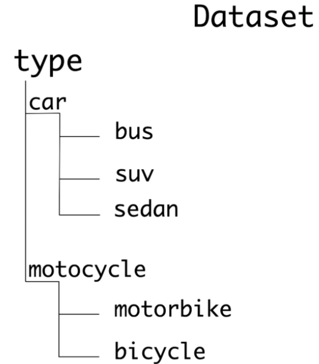
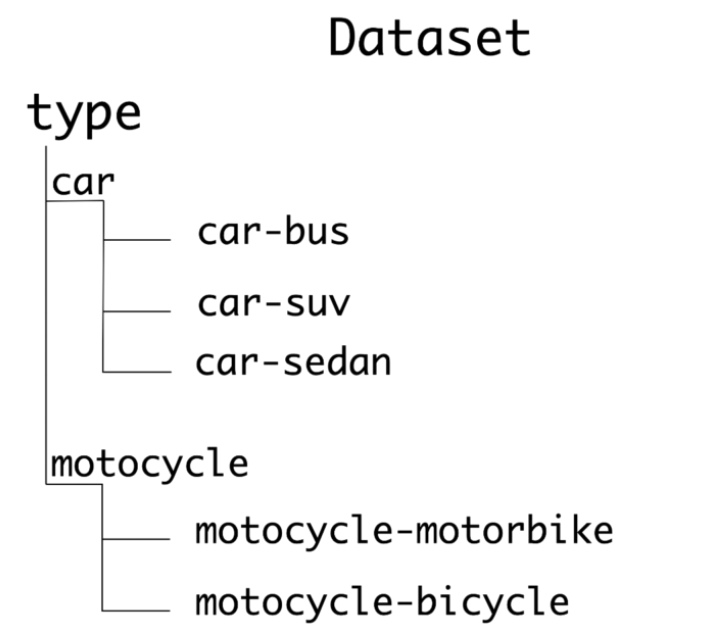
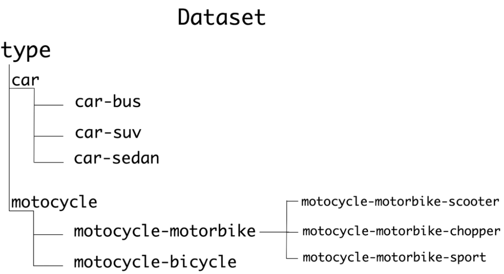
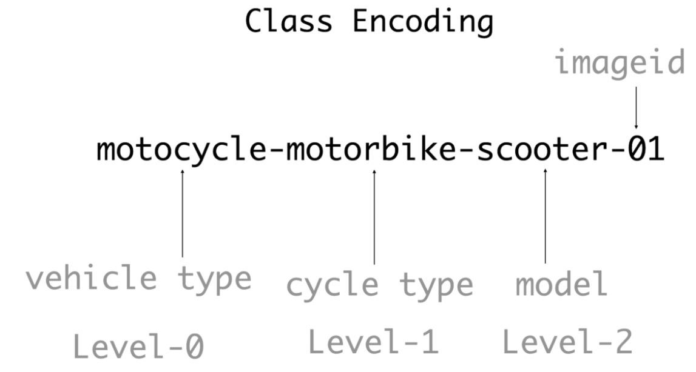
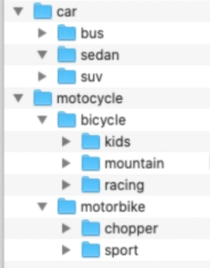
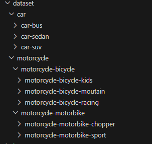

#### How to create a dataset

* Consider the following structure which can be used for both Hierarchical and Flat Classifier

* For Flat Classifiers we will read the images and assign them labels which are the **same as the leaf node / lowest child folder** e.g. if we read an SUV its label will be SUV
* For Hierarchical classifier if we read an image its label will be **the name of the parent folder** e.g. if we read an SUV image the label will be the parent folder which is car and reading motorbike it will be assigned the label of motorcycle

* naming convention for the folders 
* For subfolder put both the name of the parent folder and the name of the sub folder.  It helps to keep the hierarchy in the label of the class
* Deeper Hierarchy naming convention 

#### Class Encoding for every level

* Encoding for the folders 
* Encoding for the files 

#### Practical building of a data structure

* Create a **dataset** folder
* Create a **car** sub folder for vehicles with 4 wheels
* Create a **motorcycle** sub folder for vehicles with 2 wheels

**Add Sub classes to form the structure below** 

#### Data Collection Phase

* Start by keeping the parent class in the hierarchy of the class in the folder names 