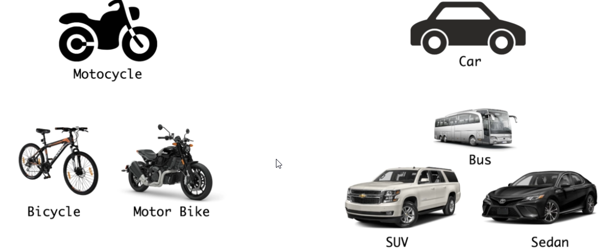
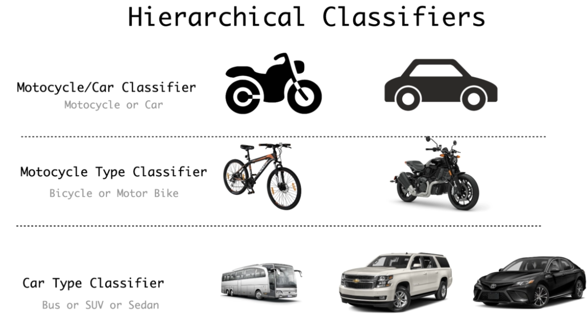
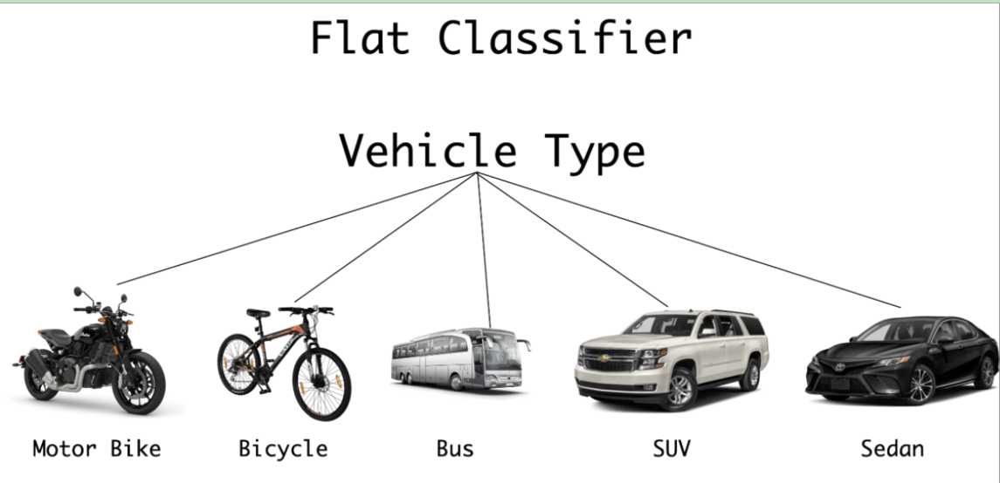

# Vehicle Type Classification

Aim of the project is to build an AI project which classifies vehicles.  We need to build a commercial level surveillance system that counts the number of cars and number of motorcycles

* first task it to classify motorcycles and cars.

#### How to build the classifier?

* Consider a hierarchical classifier Tree 

* Chosen Hierarchical Classes 

#### Limitations of Hierarchical classifiers

* Deeper hierarchy would require more classifiers to build and this might not end up not being very practical
* Advantage is that every classifier focusses on a small number of classes to recognise making it easier to train as there is a reasonable number of requirements in terms of memory and computation.  Usually these classifiers can be trained on one GPU 
* Requires as many classifiers as there are parent to child relationships in the hierarchy and you will need several trainings to develop each model.  During prediction you will need to go through several models in the hierarchy to the get the classification of a single object.

For example a classification of a car would need to go through the first classifier to identify it as either car or motorcycle and if it is a car it would have to go through to  the second classifier to be identified as either Bus, SUV or Sedan.  This will increase the prediction time.

If an object is misclassified at the parent level, all subsequent classifications would go wrong too at the next level

#### Second approach is to develop a flat classifier

* Flat file Classifier 
* All vehicle types are considered as the same level, one classifier and no parent to child relationship.
* From a design perspective this might be easy to build but might be very greedy in terms of memory - e.g. if we 100 classes the output would be a **softmax** function with 100 output values, which makes the classifier quite complex.
* In real world problems you will need a super computer to handle this and number of images will be much larger.
* In a hierarchical classifier each classifier would use a subset of images

#### Summary

* Decision will depend on the size of the dataset
* Computational resources available
* Problem complexity

#### Increased problem complexity

* Addition classes in the MotorBike category 
* Additional classes in the Bicycle category 

